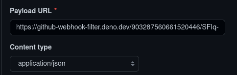

# github-webhook-filter

A webhook filter for [Deno](https://deno.land/) that filters GitHub events before forwarding them to
a Discord webhook, reducing noise.\
Additionally, it attempts to handle Discord ratelimits and resend the webhook events if needed,
instead of just dropping the requests like GitHub does.

Certain no-op events (which Discord would ignore anyway) and common CI bots are ignored by default;
see [configuration](#configuration) below for more.

## Usage

0. Host the project somewhere, for example https://deno.com/deploy. Remember to add the environment
   variables you may want to set, see [`src/config.ts`](./src/config.ts).
1. Create a Discord webhook (`https://discord.com/api/webhooks/1234/ABCDWXYZ`).
2. Take the ID (`1234`) and token (`ABCDWXYZ`) from the URL, and enter
   `https://<filter_url>/1234/ABCDWXYZ` (note: no `/github`) in the GitHub webhook settings:\
   
3. Optionally add configuration parameters (see below) to the URL, e.g.
   `?allowBranches=master|dev&hideTags=1`.
4. ????
5. Profit!

## Configuration

Additional options can be configured per URL:

- `allowBranches`: Only forward events from specific branches
  - This is case-sensitive and supports regex
  - Only full matches are considered, i.e. no substrings; `abc.*xyz` is equivalent to
    `/^(abc.*xyz)$/`
- `allowBots`: Forward events from bots
  - Accepts a bool (`1`, `0`, `true`, `false`) or a regex (see `allowBranches` for supported values)
  - If unset, ignores events only from common CI bots[^1], unless the branch is explicitly allowed
- `hideTags`: Ignore tag updates
- `commentBurstLimit`: Ignore burst PR review comments in a short timespan, only showing the first x
  comments per review

[^1]: `coveralls[bot]`, `netlify[bot]`, `pre-commit-ci[bot]`, `dependabot[bot]`
